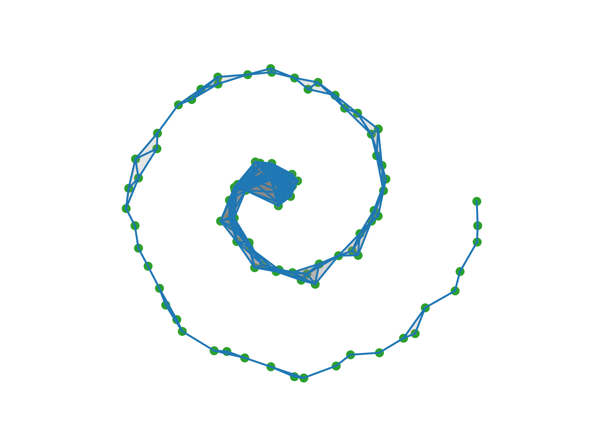

This is a picture of Vietoris-Rips complex in Euclidean space $\mathbb{R}^2$ over the filtration with $\varepsilon=2.4$. The point cloud represents a noisy spiral.
***
## Overview

This project servers as a lightweight implementation of persistent homology in Rust. The project was created as a part of the Programiranje 2 course at Faculty of Mathematics and Physics in Ljubljana.

Examples can be found in the `examples` folder.

## Features
The project currently supports:
- Point clouds over arbitrary metric spaces
- Simplexes and simplicial complexes
- Filtration of abstract types
- Vietoris-Rips complex
- Boundary operator discretisation
- Boundary matrices and $\mathbb{Z}_2$ reduction
- Betti number computation
